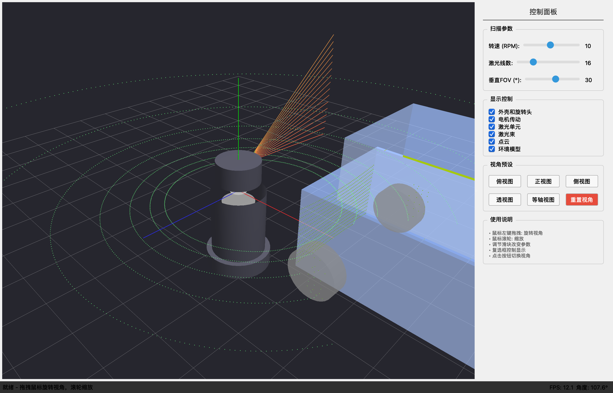
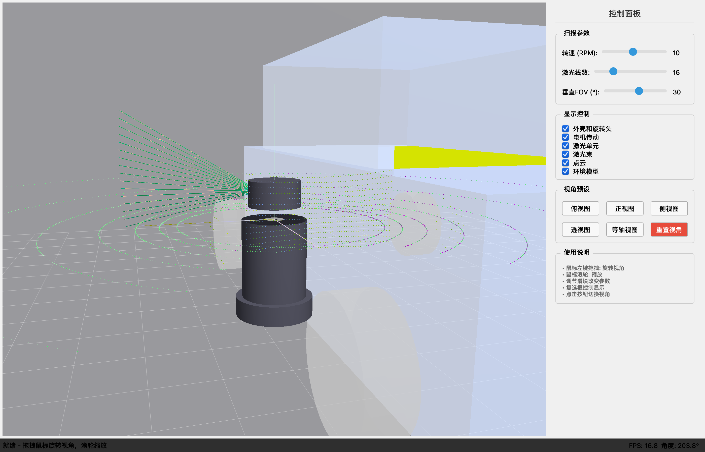
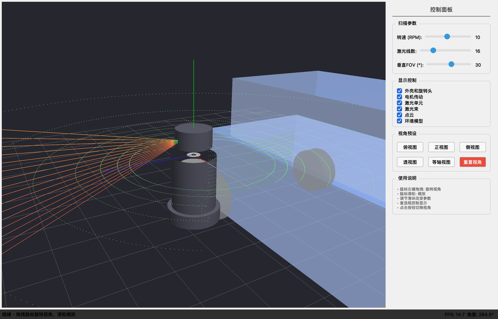
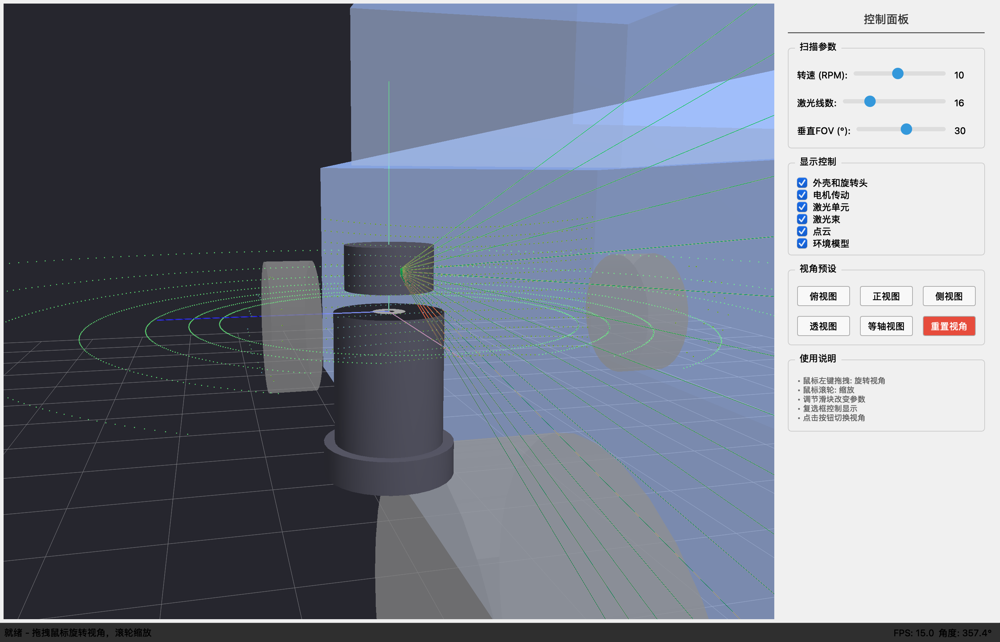
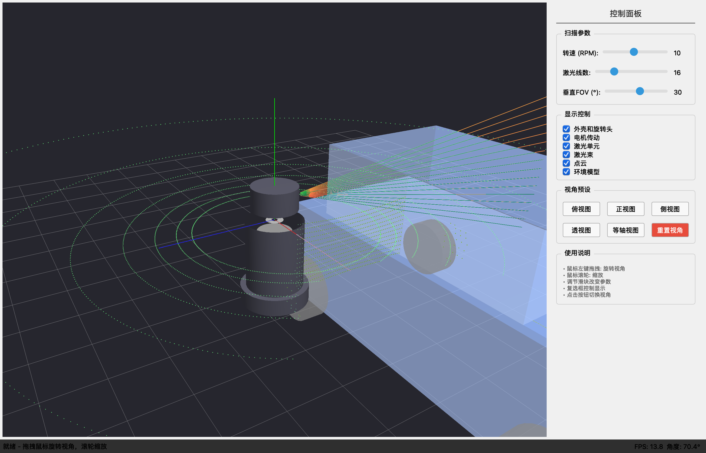
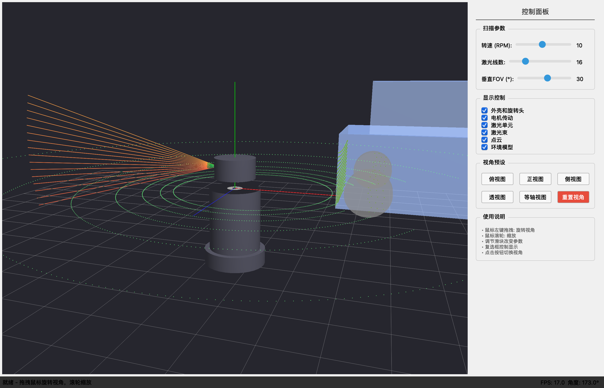
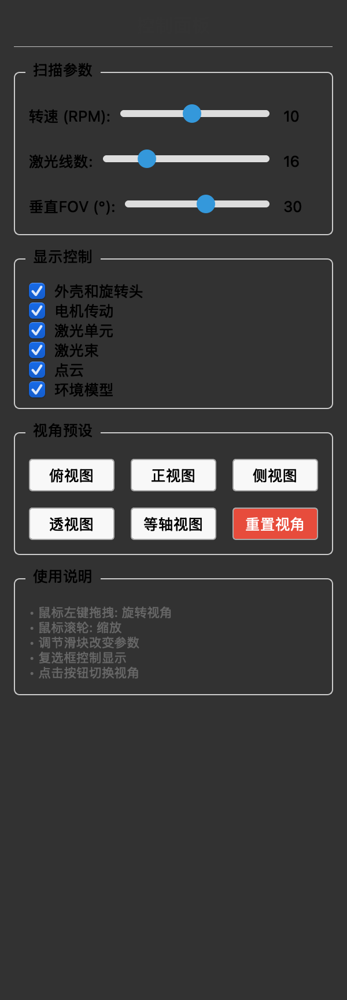

# 机械旋转式激光雷达教学演示系统

一个用于教学演示机械旋转式激光雷达工作原理的 Python 桌面应用程序。

## 系统截图

### 主界面与 LiDAR 模型

| 主界面 | LiDAR 模型 |
|:---:|:---:|
|  |  |

### 点云效果

| 透视视角 | 点云渲染 |
|:---:|:---:|
|  |  |

### 多视角展示

| 俯视图 | 等轴视图 | 正视图 |
|:---:|:---:|:---:|
|  |  |  |

### 控制面板



## 功能特性

- **LiDAR 结构展示** - 3D 模型展示机械旋转式激光雷达的组成结构
- **旋转动画模拟** - 模拟水平 360° 旋转扫描过程
- **点云实时生成** - 基于射线碰撞检测生成点云数据
- **环境物体检测** - 车辆、墙壁等环境物体
- **多视角切换** - 俯视、正视、侧视、透视、等轴视图
- **参数可调** - 转速、激光线数、垂直视场角

## 核心算法

### 射线-长方体相交（Slab 方法）

将 AABB 看作三个无限 Slab 的交集，分别处理 X、Y、Z 三个轴的区间相交问题。

### 射线-圆柱相交

求解二次方程：`(dx² + dz²)t² + 2(ox·dx + oz·dz)t + (ox² + oz² - r²) = 0`

### 点云生成

```
LiDAR 发射器 → 遍历 360° 水平角度 × 激光线数 → 射线投射 → 碰撞检测 → 点云数据
```

## 快速开始

### 安装依赖

```bash
pip install PyQt5 PyOpenGL numpy
```

### 运行程序

```bash
python main.py
```

## 操作指南

### 快捷键

| 键 | 功能 |
|----|------|
| `R` | 重置视角 |
| `1` | 俯视图 |
| `2` | 正视图 |
| `3` | 侧视图 |
| `4` | 透视图 |
| `5` | 等轴视图 |
| `ESC` | 退出程序 |
| 鼠标拖拽 | 旋转视角 |
| 鼠标滚轮 | 缩放 |

### 控制面板参数

**扫描参数：**
- 转速 (RPM): 1-20，默认 10
- 激光线数: 1-64，默认 16
- 垂直 FOV: 10-45°，默认 30°

## 项目结构

```
lidar_architecture/
├── main.py                 # 程序入口
├── requirements.txt        # 依赖列表
├── start.sh / start.bat    # 启动脚本
├── ui/
│   ├── main_window.py      # 主窗口
│   └── control_panel.py    # 控制面板
├── opengl/
│   ├── gl_widget.py        # OpenGL 渲染
│   ├── scene.py            # 场景管理
│   ├── camera.py           # 相机控制
│   └── environment.py      # 环境模型与碰撞检测
└── docs/
    ├── textbook/           # 教材文档
    ├── images/             # 截图
    └── plans/              # 设计文档
```

## 技术栈

| 组件 | 技术 |
|------|------|
| GUI 框架 | PyQt5 |
| 3D 渲染 | PyOpenGL |
| 数学计算 | NumPy |
| 动画计时 | QTimer |

## LiDAR 关键参数

| 参数 | 说明 | 典型值 |
|------|------|--------|
| 转速 (RPM) | 水平旋转速度 | 5-20 RPM |
| 线数 | 垂直方向激光器数量 | 16/32/64/128 |
| 垂直视场角 | 垂直扫描范围 | ±15° ~ ±30° |
| 水平分辨率 | 水平角度分辨率 | 0.1° ~ 0.4° |
| 探测距离 | 最大有效距离 | 100m ~ 200m |

## 参考资料

- [PyOpenGL 文档](http://pyopengl.sourceforge.net/)
- [PyQt5 文档](https://www.riverbankcomputing.com/static/Docs/PyQt5/)
- [PCL (Point Cloud Library)](https://pointclouds.org/)
- [Open3D](http://www.open3d.org/)

## License

MIT License
